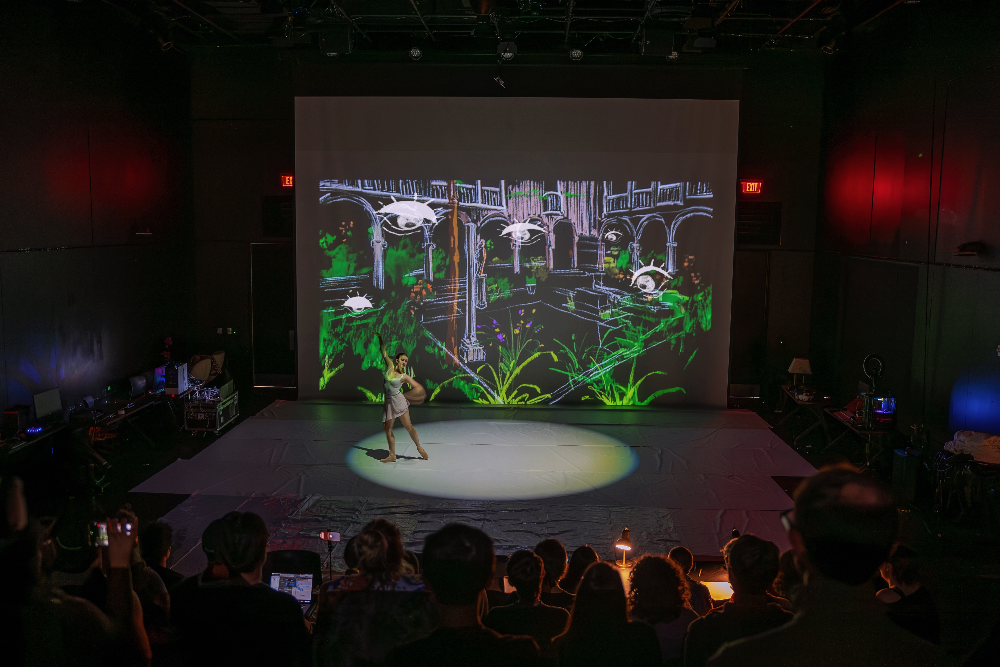

# Timeless Flow
### Interactive Live Ballet Performance
Ballet, with its deep roots in tradition, represents centuries of elegance and disciplined expression, but today it has become resistant to change, fueling a decline in popularity. Historically, ballet was a space for bold innovation, and we believe classical arts have the potential to evolve while honoring its heritage. In Timeless Flow, we merge classical ballet’s beauty with cutting-edge technology, creating an ever-changing art form shaped by both the performer and audience. Through live projection, the stage becomes a canvas that responds to the presence and movements of the audience, making them co-creators in the performance. This interplay between tradition and innovation brings ballet into the present, where it can continue to grow without losing its essence.

